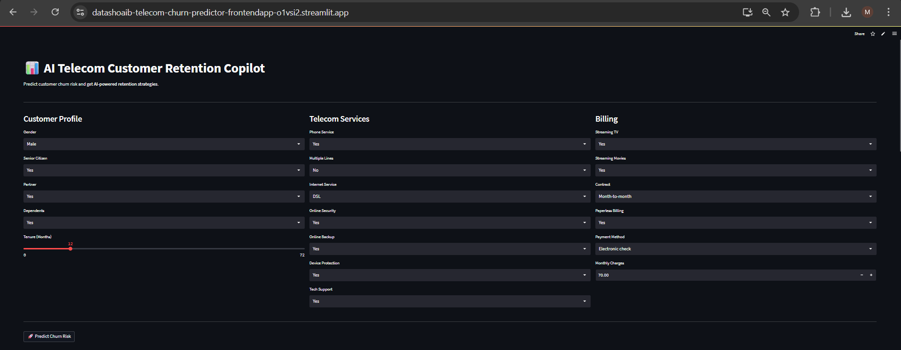
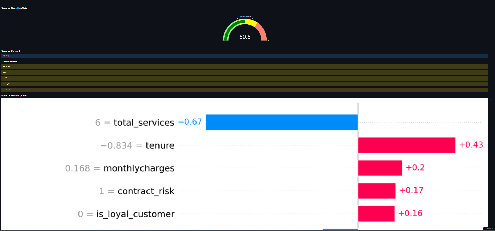

# 📡 AI Telecom Customer Retention Copilot

> **End-to-end ML system** that predicts customer churn probability, explains model decisions with SHAP, and delivers AI-powered retention strategies via a Groq LLM — all inside a live Streamlit application.

🔗 **Live Demo:** [datashoaib-telecom-churn-predictor-frontendapp.streamlit.app](https://datashoaib-telecom-churn-predictor-frontendapp-o1vsi2.streamlit.app)

---

## 🎯 Business Problem

In the telecom industry, customers can freely switch between providers at any time. **Acquiring a new customer costs 5–7× more than retaining an existing one.** Identifying customers likely to churn *before* they leave allows retention teams to act proactively — offering targeted incentives, contract upgrades, or support interventions — turning a potential loss into a loyalty win.

This project builds an intelligent copilot that gives retention teams:
- A **real-time churn probability score** for any customer
- **SHAP-based explanations** of exactly which factors are driving the risk
- **LLM-generated retention strategies** tailored to that specific customer's profile
- A **downloadable PDF report** ready for business stakeholders

---

## 🖼️ Application Preview

| Customer Input Form | Churn Risk Meter & SHAP Explanation |
|---|---|
|  |  |

---

## 🏗️ System Architecture

```
Raw Data (CSV)
     │
     ▼
┌─────────────────────────────────────────────────┐
│              Data Pipeline                       │
│  EDA → Cleaning → Feature Engineering           │
└─────────────────────────────────────────────────┘
     │
     ▼
┌─────────────────────────────────────────────────┐
│           ML Pipeline (scikit-learn)             │
│  ColumnTransformer → Logistic Regression        │
│  (SMOTEENN for class imbalance)                 │
└─────────────────────────────────────────────────┘
     │
     ▼
┌─────────────────────────────────────────────────┐
│         Explainability Layer (SHAP)              │
│  LinearExplainer → Feature Impact Scores        │
└─────────────────────────────────────────────────┘
     │
     ▼
┌─────────────────────────────────────────────────┐
│         AI Insight Layer (Groq LLM)              │
│  llama-3.3-70b → Business Retention Strategy    │
└─────────────────────────────────────────────────┘
     │
     ▼
┌─────────────────────────────────────────────────┐
│         Streamlit Frontend                       │
│  Gauge Chart · SHAP Bar Plot · PDF Report       │
└─────────────────────────────────────────────────┘
```

---

## ✨ Key Features

- **Real-time Churn Prediction** — probability score with colour-coded gauge (green / yellow / red)
- **SHAP Model Explainability** — feature-level impact bar chart showing *why* a customer is at risk
- **AI Retention Copilot** — Groq LLM (Llama 3.3 70B) generates a three-section business brief: risk summary, key drivers, and recommended actions
- **Business Recommendations Engine** — rule-based suggestions triggered by contract type, payment method, tenure, and monthly charges
- **PDF Report Download** — one-click export of the full analysis for sharing with stakeholders
- **Engineered Domain Features** — 8 custom features derived from telecom business logic (see below)

---

## 📊 Dataset

| Property | Value |
|---|---|
| Source | IBM Telco Customer Churn Dataset |
| Records | 7,043 customers |
| Features (raw) | 21 |
| Features (after engineering) | 33 |
| Target | Churn (Yes / No) — 26.5% positive rate |
| Class Imbalance Handling | SMOTEENN (combined over + under sampling) |

---

## 🔬 Exploratory Data Analysis — Key Findings

| Signal | Insight |
|---|---|
| **Contract type** | Month-to-month customers churn at 3× the rate of two-year contract holders |
| **Payment method** | Electronic check users show the highest churn propensity among all payment types |
| **Internet service** | Fiber optic customers churn more than DSL users despite (or because of) higher monthly charges |
| **Tenure** | Short-tenure customers (< 6 months) have the highest churn rate; loyalty increases sharply after 24 months |
| **Senior citizens** | Senior customers churn at a disproportionately higher rate than non-seniors |
| **Add-on services** | Customers subscribed to security, backup, and support services are significantly less likely to churn |
| **Total charges** | Dropped due to near-perfect multicollinearity with tenure (r = 0.83) |

---

## ⚙️ Feature Engineering

Eight business-logic features were created from EDA findings:

| Feature | Logic | Business Rationale |
|---|---|---|
| `contract_risk` | 1 if Month-to-month | Strongest individual churn signal |
| `paymentmethod_risk` | 1 if Electronic check | Correlated with low commitment |
| `is_autopay` | 1 if automatic payment | Auto-pay customers are more committed |
| `seniorcitizen_risk` | 1 if Senior Citizen | Higher churn demographic |
| `is_new_customer` | 1 if tenure ≤ 6 months | Early churn window |
| `is_loyal_customer` | 1 if tenure > 24 months | Retention signal |
| `total_services` | Sum of 6 add-on services (0–6) | Service stickiness proxy |
| `has_internet` | 1 if DSL or Fiber optic | Internet users are higher-value customers |

---

## 🤖 Model Development

### Models Evaluated

| Model | Test AUC | Precision | Recall | F1 Score | Fit Status |
|---|---|---|---|---|---|
| Logistic Regression | 0.8303 | 0.6416 | 0.5695 | 0.6034 | Good Fit ✅ |
| **LightGBM** | **0.8400** | 0.5102 | **0.8021** | **0.6237** | Good Fit ✅ |
| Gradient Boosting | 0.8382 | 0.6392 | 0.5401 | 0.5855 | Slight Overfit ⚠️ |

All three models were tuned via `RandomizedSearchCV` with `StratifiedKFold (k=5)`.

### Final Model — Logistic Regression

Although LightGBM achieved the highest F1 score, **Logistic Regression was selected as the production model** for the following reasons:

- **Negligible performance gap** — LightGBM is only ~1.6% better in F1; this does not justify added complexity
- **SHAP-compatible** — `LinearExplainer` produces exact, fast SHAP values; tree-based SHAP is approximate and slower
- **Production ready** — significantly faster inference, easier to monitor and maintain
- **Interpretable by default** — coefficients directly quantify each feature's effect on churn probability
- **No overfitting** — stable generalisation across folds without regularisation tuning overhead

> *"Always choose the simplest model that satisfies your business requirements. A 1–2% performance difference does not justify added operational complexity."*

---

## 🧠 Model Explainability (SHAP)

The application uses `shap.LinearExplainer` to compute feature-level contribution scores for each prediction. Three SHAP visualisations are generated:

- **Summary plot** — global feature importance with direction (red = increases churn risk, blue = decreases it)
- **Bar plot** — ranked mean absolute SHAP values across the test set
- **Waterfall plot** — single-customer explanation showing how each feature shifts the prediction from the base rate

From the live demo, the top SHAP drivers for a high-risk customer are:
`tenure` · `total_services` · `monthlycharges` · `contract_risk` · `is_loyal_customer`

---

## 🗂️ Project Structure

```
telecom-churn-predictor/
│
├── data/
│   ├── raw/                    # Original Telecom_Churn.csv
│   ├── interim/                # Cleaned data
│   └── processed/split/        # X_train, X_test, y_train, y_test
│
├── frontend/
│   └── app.py                  # Streamlit application
│
├── models/
│   └── model.pkl               # Serialised sklearn Pipeline
│
├── notebook/
│   └── Telecom_Churn_Predictor.ipynb  # Full EDA + modelling notebook
│
├── src/
│   ├── ai_summary/
│   │   └── summary_generator.py       # SHAP + Groq LLM inference
│   ├── data/
│   │   └── data_ingesion.py           # Data loading & binary encoding
│   ├── evaluation/
│   │   └── model_evaluation.py        # Metrics & reporting
│   ├── feature/
│   │   └── feature_eng.py             # Feature creation functions
│   └── model/
│       └── model_building.py          # Training pipeline
│
├── logger/
│   └── logger.py               # Centralised logging
│
├── assets/                     # Screenshots for README
├── reports/                    # Generated evaluation reports
├── requirements.txt
└── README.md
```

---

## 🛠️ Tech Stack

| Category | Tools |
|---|---|
| Language | Python 3.12 |
| Data Processing | pandas, NumPy |
| Visualisation | Matplotlib, Seaborn, Plotly |
| Machine Learning | scikit-learn, imbalanced-learn (SMOTEENN) |
| Boosting (evaluated) | LightGBM, XGBoost, Gradient Boosting |
| Explainability | SHAP (LinearExplainer) |
| LLM | Groq API — Llama 3.3 70B Versatile |
| Frontend | Streamlit |
| PDF Generation | ReportLab |
| Environment | python-dotenv, Streamlit Secrets |

---

## 🚀 Running Locally

**1. Clone the repository**
```bash
git clone https://github.com/datashoaib/telecom-churn-predictor.git
cd telecom-churn-predictor
```

**2. Create a virtual environment and install dependencies**
```bash
python -m venv venv
source venv/bin/activate        # Windows: venv\Scripts\activate
pip install -r requirements.txt
```

**3. Add your Groq API key**

Create a `.streamlit/secrets.toml` file:
```toml
OPENAI_API_KEY = "gsk_your_groq_api_key_here"
```

Or set it as an environment variable in a `.env` file:
```
OPENAI_API_KEY=gsk_your_groq_api_key_here
```

Get a free Groq API key at [console.groq.com](https://console.groq.com).

**4. Run the application**
```bash
streamlit run frontend/app.py
```

---

## 🧪 Reproducing the Model

Open and run the full notebook end-to-end:
```bash
jupyter notebook notebook/Telecom_Churn_Predictor.ipynb
```

The notebook covers:
1. EDA and data cleaning
2. Feature engineering
3. Baseline model (Logistic Regression)
4. Model selection (LR vs LightGBM vs Gradient Boosting)
5. Hyperparameter tuning (RandomizedSearchCV)
6. Final evaluation and model persistence
7. SHAP explainability analysis
8. Groq LLM integration prototype

---

## 📈 Business Impact

| Metric | Value |
|---|---|
| Churn customers correctly identified (Recall) | **~57–80%** depending on threshold |
| ROC-AUC | **0.83** |
| Model type | Production-grade sklearn Pipeline |
| Inference latency | < 100 ms (Logistic Regression) |
| Explainability | Full SHAP attribution per prediction |
| Stakeholder output | Automated PDF report with AI-written retention brief |

At a conservative estimate, identifying even 10% additional churners before they leave — and retaining half of them — can generate significant ARPU recovery for a mid-size telecom operator. The copilot's LLM layer translates model output into actionable language that non-technical retention agents can act on immediately.

---

## 🔮 Future Improvements

- Add time-series features from customer billing history
- Deploy as a REST API (FastAPI) for CRM integration
- Implement A/B testing framework for retention offer effectiveness
- Add batch scoring mode for scoring an entire customer cohort at once
- Experiment with calibrated probability outputs for better-calibrated risk scores

---

## 👤 Author

**Shoaib** — Aspiring ML Engineer | Data Science Portfolio

Connect on [LinkedIn](https://www.linkedin.com/in/datashoaib) · View more projects on [GitHub](https://github.com/datashoaib)